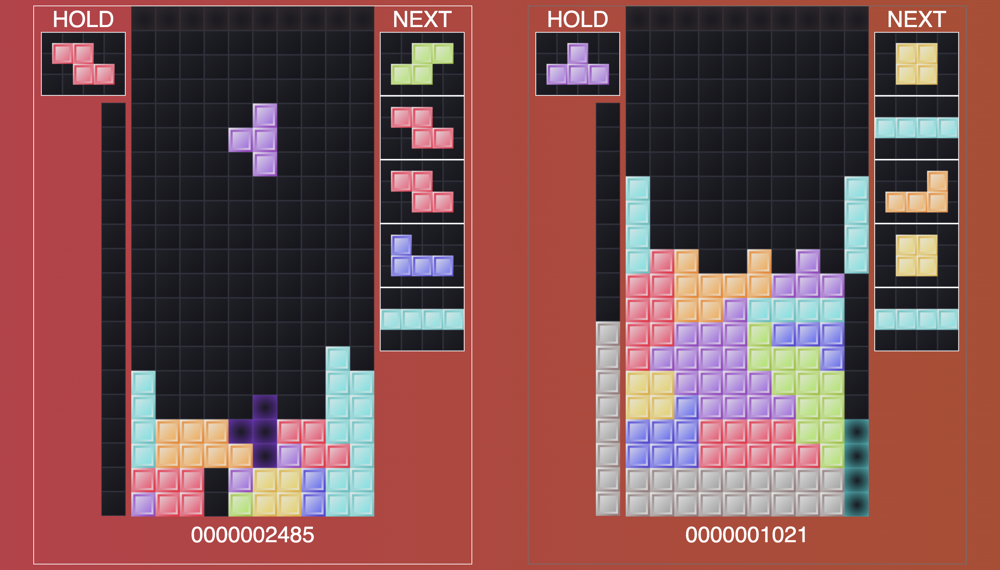

# Tetris v2
This is a Javascript Tetris game.

# Setup
In the project directory, run `npm install` and `npm start`.

Go to `localhost:9000` in your browser and press space to start playing immediately.

# Goal of the Game
Drop pieces to the bottom of the screen. When you fill up an entire row, they will clear and earn you points.
Survive as long as possible and earn as much points as possible.
When playing with an opponent, survive longer than they do and sabotage their efforts by sending them "garbage" lines.

# Controls
| Key | Action |
| --- | ------ |
| ← (Left) | Move Left |
| → (Right) | Move Right |
| ↓ (Down) | Soft Drop |
| ↑ (Up) | Hard Drop |
| 🆀 (Q) | Rotate Left |
| 🆆 (W) | Rotate Right |
| 🅳 (D) | Hold |
| [   ] (Space) | Pause |

Soft Drop: Manually moves the piece downward.
Hard Drop: Sets the piece immediately where the ghost piece is.
Hold: Saves the current piece for later use. If you have a piece saved already, swaps your current piece with the one being held.

Note: You can only hold once per turn.

# Scoring
| # of Lines Cleared | Points | Garbage Lines Sent |
| --- | --- | --- |
| 1 line | 100 pts | 0 lines |
| 2 lines | 300 pts | 1 line |
| 3 lines | 500 pts |  2 lines |
| 4 lines (Tetris) | 800 pts |  4 lines |

# Current Features
- Able to clear lines and earn points
- If the blocks reach the top, it is Game Over (game will end)
- Keeps score
- Increases speed based on score
- Able to hold pieces
- Able to Hard Drop (immediately drops piece into place)
- Ghost piece (shows where your piece will land if hard-dropped)
- Piece forecast shows next five pieces
- Ability to play with other people via WebSockets
- Ability to attack opponent player (called garbage lines)
- Ability to nullify garbage lines
- Ability to start the game at will
- Made player unable to rotate on key repeat

# Latest Updates
- Player can see incoming attacks via indicator
- Player can see opponents' indicators as well
- Improved graphics

# Faithful Recreation
- Colors reflect actual Tetris pieces used in-game
- Guaranteed one of each letter at the beginning of a session, just like the real game
- Accurate point system for 1-4 line clears and soft drops

# Upcoming Features
- Implementing SRS (for advanced spins and wall kicks)
- Perfect clear points + attack
- Ability to play using https

# Known Bugs/Issues
- None

# Sources
Project started using this tutorial: https://youtu.be/H2aW5V46khA
All improvements, and additional features added by me.
